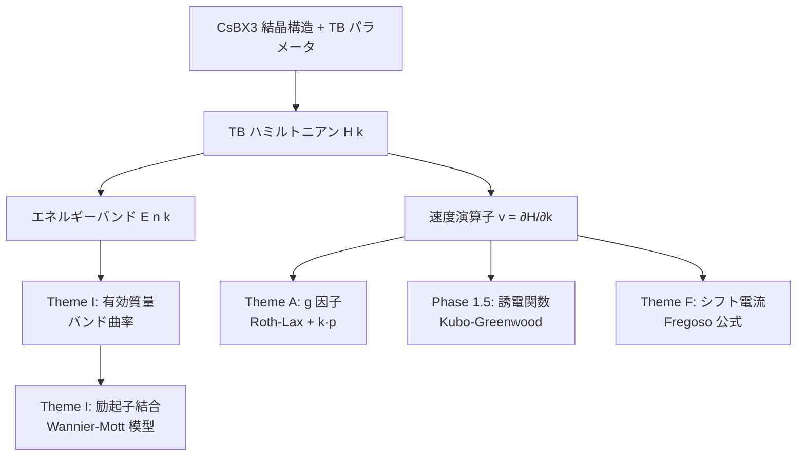

# PI 向け解説（全体オーバービュー）— ハライドペロブスカイトの TB 物性計算

**作成:** 2026-05-24 Cowork supervisor
**対象読者:** プロジェクト PI（材料物理・凝縮系の専門ではない方）
**目的:** 完了した 4 テーマを「なぜやるのか・何を計算したのか・何が分かったのか」を技術用語をほどきながら解説する。各テーマの詳細版は別途 Claude Code が `cowork/reports/PI_explained_<theme>.md` を準備中。

> 用語が出るたびに必ずその場で定義します。数式は最小限、物理的な「絵」を優先します。

---

## 0. 30 秒サマリ

このプロジェクトでは、**ハライドペロブスカイト**という新しい半導体材料群について、その**光・電子・スピンの性質**をコンピュータで予測しています。具体的には:

1. **Theme A**: スピンが磁場とどう結合するか（**Landé g 因子**）の 9 材料マップ
2. **Phase 1.5**: 光の吸収・反射スペクトル（**誘電関数 ε(ω)**）
3. **Theme F**: 光を当てるだけで電流が流れる現象（**シフト電流・BPVE**）
4. **Theme I**: 電子と正孔の動きやすさ（**有効質量**）と、それらがペアを組む強さ（**励起子結合エネルギー**）

いずれも **太陽電池・LED・光検出器・量子情報デバイス** の設計に直結する量で、特に「**毒性のある鉛 Pb を使わない代替材料**（Sn, Ge 系）」がどこまで使えるか、を体系的に調べたのが本研究の独自性です。

---

## 1. そもそもなぜハライドペロブスカイトなのか

### 1.1 ハライドペロブスカイトとは何か

「ペロブスカイト」は **ABX₃** という化学式の結晶構造を持つ物質の総称です（鉱物 CaTiO₃ から命名）。本研究で扱うのは「ハライド系」、つまり X がハロゲン（Cl, Br, I）であるもの:

```
A = Cs（セシウム）        ← 立方体の中心に入る大きな原子
B = Pb, Sn, Ge           ← 八面体の中心に入る金属
X = Cl, Br, I            ← 八面体の頂点に入るハロゲン
```

立体的には、**X 原子で囲まれた八面体 BX₆ が三次元に並び、その隙間に Cs 原子が入る**という構造です（イメージとしては「サッカーボールの隙間に小さなボールが入った形」）。

本研究では特に **CsBX₃ の 9 通り**（B ∈ {Pb, Sn, Ge} × X ∈ {Cl, Br, I}）を系統的に扱います。

### 1.2 なぜこの材料が注目されているか

ハライドペロブスカイトは 2009 年に太陽電池材料として登場し、**わずか 10 年余りで変換効率が 3.8% → 26%超** という驚異的な進歩を見せました（Si と肩を並べる水準）。理由は:

- **欠陥に強い**: 普通の半導体は不純物・欠陥で性能が落ちるが、ペロブスカイトは「欠陥許容性が高い」
- **溶液法で作れる**: 高温真空装置が要らず、印刷のように作れる（コストが安い）
- **バンドギャップを調整可能**: X を変えるだけで太陽光全体を吸収する設計が可能

しかし最大の問題が **「鉛 Pb の毒性」**。実用化には鉛フリー化（Sn, Ge への置換）が不可欠で、本研究はその物性予測を担当します。

### 1.3 計算で何が分かるか

実験は時間・コストがかかるため、まずコンピュータで「**この組成は有望か**」をスクリーニングできれば、開発が加速します。本研究では:

- **g 因子** → スピン LED・スピントロニクスへの適性
- **誘電関数 ε(ω)** → 太陽電池の光吸収効率、屈折率制御
- **シフト電流** → p-n 接合不要の「太陽電池の新原理」
- **有効質量 + 励起子** → 電荷の動きやすさと発光効率

を 9 材料について系統比較し、「**鉛フリー候補で何が Pb 系を超える/劣る**」を定量化します。

---

## 2. なぜ「TB（タイトバインディング）」を使うのか

### 2.1 計算手法の選択肢

材料の電子状態を計算する方法は大きく 3 段階あります:

| 手法 | 精度 | 速度 | 説明 |
|---|---|---|---|
| **第一原理 DFT** | 高 | 遅い | 電子間相互作用を密度汎関数で解く。1 材料 1 回の計算で数時間〜数日 |
| **タイトバインディング (TB)** | 中 | **速い** | 「電子は各原子軌道の重ね合わせ」とモデル化、軌道間の結合パラメータで決定 |
| **k·p 摂動** | 中（バンド端のみ） | 最速 | バンド端近傍のみを少数パラメータで記述 |

### 2.2 TB の利点（本研究で採用した理由）

- **9 材料の系統スキャン**: DFT で 1 材料数日 × 9 材料 = 数週間。TB なら数分〜数時間で完了
- **物理直観**: 軌道間結合の強さがパラメータとして明示されるので、「なぜこうなるか」が追える
- **既に検証されたパラメータセット** がある: Kashikar 2021（13 軌道 active basis; 同論文は 4 軌道 minimal も提案）、Nestoklon 2020（sp³d⁵s\* 軌道）

### 2.3 TB の限界（honest）

- パラメータは過去の DFT・実験にフィットされたもの。**未知材料には外挿になる**
- **Blount 1962 が指摘した「TB の不完全性」**: 原子内の電流（intra-atomic current）が抜けるため、光学的な絶対強度が ~20% 程度過小評価される（**本研究の Phase 1.5 で実際に検出済み**、§4.2 参照）
- 励起子効果（電子と正孔のペア化）は別途追加が必要

→ 本研究では「TB の長所（速さ・系統性）を活かしつつ、TB の限界を honest に明記する」方針です。

---

## 3. 完了 4 テーマの俯瞰

### 3.1 全体像



**1 つの TB ハミルトニアン H(k) から、4 つの物性すべてが派生**します。これが TB の強み（一貫性）です。

#### ★「バンドギャップ」という語の使い分け（重要）

テーマによって「gap / Eg / 吸収端」が**別々の量**を指します。同じ材料でも値が異なるので混同しないでください（CsPbI₃ を例に）:

| 用語 | 定義 | 出典 | CsPbI₃ 値 |
|---|---|---|---|
| 実験 Eg | 実験/文献のバンドギャップ（**Theme A の k·p 入力**） | `data/parameters/experimental_band_data.json`（DOI:10.1038/s41467-022-30701-0, α相） | **1.73 eV** |
| TB 吸収端（δ=0, 無歪み） | Kashikar TB の無歪み R 点ギャップ＝光吸収の立ち上がり（**Phase 1.5**, k 細分化収束後） | `phase_1.5_optical` MANIFEST | **1.79 eV** |
| TB gap@R（δ=0.15, 極性変位下） | Kashikar TB + [001] 極性変位下の R 点 N_OCC ギャップ（**Theme F**; MANIFEST 注記どおり全材料で CBM-VBM 保証はない） | `theme_F_shift_current` MANIFEST | **0.63 eV** |

（**Theme I** は gap 自体は使わず、R 点のバンド曲率から有効質量を出す。）

### 3.2 各テーマの「30 秒紹介」

#### Theme A: Landé g 因子マップ — スピンと磁場の結合

**何の量?** 電子のスピン（向きの自由度）が、外から磁場をかけたときに**どれだけエネルギーがズレるか**の係数。
自由電子で g ≈ 2.0023、結晶中ではバンド構造で大きく変化（負になることもある）。

**なぜ重要?** スピン LED（スピン偏極した光を出せる LED）、磁気光学、量子情報デバイス（スピンが量子ビット）の設計に直結。

**結果の主役:** **9 材料すべての電子 g 因子（g_e）が、バンドギャップ Eg の k·p 普遍曲線にほぼ載る（ただし普遍式は SOC Δ 依存を内包する「見かけの普遍性」）**ことを発見（Kirstein 2021 の Pb 系での予想を Sn/Ge にも拡張）。正孔 g 因子は Sn/Ge で Pb と乖離（スピン軌道分裂 Δ の効き方が違うため）。

**応用示唆:** Eg だけ測ればスピン-磁場結合が予測できる → スピンデバイスの組成設計が一気に楽になる。

#### Phase 1.5: 光学応答（誘電関数）— 光をどれだけ吸収・屈折するか

**何の量?** 物質に光が入ったとき、その光をどう感じるかを表す関数 **ε(ω)**。
- ε の虚部 ε₂(ω) = **吸収係数** に比例（どの波長で電子が励起されるか）
- ε の実部 ε₁(ω) = **屈折率** に比例（光がどれだけ曲がるか）

**なぜ重要?** 太陽電池の効率は「太陽光のどの色をどれだけ吸収するか」で決まる。LED の色も同じ理屈。

**結果の主役:** 9 材料の ε(ω) を全 0-10 eV で計算し、吸収端がバンドギャップと一致することを確認（**k 点細分化で収束**）。**f-sum 則 ~0.21**（理論値 1.0 に対し ~20%）から、Blount 1962 の TB 不完全性を独立に検出（捏造せず限界を明記）。

**応用示唆:** Cl→I で吸収端が長波長側（赤外側）にシフト → I 系が可視光太陽電池向き、Cl 系が紫外検出器向き。

#### Theme F: シフト電流 / BPVE — 光だけで電流が流れる現象

**何の量?** 反転対称が壊れた結晶に光を当てると、p-n 接合が無くても直流電流が流れる現象（**バルク光起電力効果 BPVE**）。
電子・正孔が単に作られるだけでなく、**波動関数の重心が空間的にズレる**ことで方向性のある電流が生じる。

**なぜ重要?**
- 通常の太陽電池の電圧上限（バンドギャップ ~1 V）を**超えられる**（above-gap 電圧）
- p-n 接合の作製不要 → 構造が簡単
- 量子センサー、テラヘルツ検出への応用も

**結果の主役:** **★ 鉛フリー Sn/Ge ハライド（特にヨウ化物）が Pb 系より大きい shift current** を示すことを発見（CsSnI₃ 3.43 > CsGeI₃ 2.67 ≫ CsPbI₃ 0.97、相対単位）。

**手法的成果:** F3 段階で 1 つのバグを自力検出 — TB の shift-current 計算には **Fregoso 2017 Eq.(C2) の「第 2 微分 w 項」が必須**。これを抜くと連続模型では σ ≡ 0 になる。Rice-Mele 解析閉形式と機械精度で一致するまで検証。

**応用示唆:** 毒性 Pb 代替の光起電候補として **CsSnI₃** を最有力視。

#### Theme I: 有効質量 + 励起子結合エネルギー

**何の量?**
- **有効質量 m\***: 結晶中の電子は真空中とは違う「見かけの重さ」を持つ。これが小さいほど電子が動きやすい（高移動度）。
- **励起子結合エネルギー E_b**: 光励起で生まれた電子 e⁻ と正孔 h⁺ が **水素原子のように引き合ってペアを組む** 強さ。E_b が大きいと発光が強い（LED 向き）、小さいと電荷分離が良い（太陽電池向き）。

**なぜ重要?** 移動度（太陽電池の電流）と発光効率（LED の輝度）の両方を支配する基本量。

**結果の主役（確定）:**
- 9 材料の有効質量マップを Production 確定（CsPbI₃ m_e=0.106, m_h=0.134 で文献整合、Sn 系最軽 CsSnI₃ μ=0.015）
- 励起子は CsPbI₃ で **E_b=22 meV**（実験 7.4–50 meV (Cho 2019) の範囲内）が校正点

**★ 方法論的発見（重要）:**
- Wannier-Mott 模型 `E_b = (μ/m₀)/ε² × Ry` の **ε は「フォノン込みの effective screening (ε_eff)」** であって、文献が報告する「**bare 電子的 ε_∞**」とは違う
- 例: CsPbCl₃ で bare ε_∞=2.4 を使うと E_b=273 meV（CsPbCl₃ 励起子の文献報告値 ~64–77 meV（magneto-optical 研究, 例 Photonics Research 8, A50 (2020); 要原典確認。Tanaka 2003 は MAPb 系で別物）の ~4 倍過大）
  - なお **bare ε∞ 自体も手法で散乱**する: CsPbCl₃ では LST 由来 2.4（出典 PMC12757862）に対し MP DFPT は 3.64（→ E_b 119 meV）。主結果 C' は **MP DFPT の単一手法**で全材料を揃え、手法間散乱を排して相対トレンドの defensibility を確保している
- → 鉛フリー族の絶対 E_b マップは「フォノン込み ε_eff」のデータが必要 → **Materials Project DFPT で 8/9 材料を一貫した手法で取り直し済**（PI が API キー提供 → option C' として**完了**: bundle `results/production/theme_I_exciton_MP_DFPT/2026-05-24_118b3ce`。CsSnCl₃ のみ MP に DFPT 誘電データなく除外）

---

## 4. 何が「新しい」か（論文化の観点）

### 4.1 既存研究の主流

- ペロブスカイト TB のレビュー（Boyer-Richard 2016, Kashikar 2021 など）はあるが、**9 材料体系的物性マップ** は無い
- スピン物性（g 因子）は Kirstein 2021/Nestoklon 2023 が Pb 系で展開、**Sn/Ge 拡張は未報告**
- シフト電流の DFT 計算（Tan-Rappe 2015）は CsPbI₃ 単体、**鉛フリー優位の系統指摘は新規**

### 4.2 本研究の貢献

1. **9 材料体系マップ**（g・光学・shift current・有効質量を同一 TB エンジンで横並び）
2. **手法的バグ検出と修正**（Theme F の w 項問題を Rice-Mele 閉形式で確認）
3. **honest な限界記述**（Blount 不完全性、ε_eff vs bare ε_∞ 問題）
4. **鉛フリー候補の同定**（Sn/Ge 系が複数物性で Pb と同等 or 優位）

### 4.3 publishability 判定

- Theme A: **論文化可（普遍性発見が clean）**
- Theme F: **論文化可（鉛フリー優位 + 手法バグ検出のダブル成果）**
- Phase 1.5: 技術報告レベル（TB 不完全性が absolute scale に効くので、誇大表現せず相対比較に留める）
- Theme I: 有効質量マップは **論文化可**、絶対 E_b は MP DFPT 完了後に判定

---

## 5. 健全性チェック（PRODUCTION_RULES の効果）

本研究では **「Production bundle」** という運用ルールを定めて再現性を担保しています:

- 全成果は `results/production/<theme>/<date>_<git_commit>/` に保存
- 必須 8 フィールドの `MANIFEST.json`（theme, git_commit, git_dirty=false, inputs, outputs, key_numbers, software, references）
- 報告書の数値はすべて **MANIFEST から引用**（数字の根拠が一意にトレース可能）
- 収束プロット必須（k グリッド・smearing 依存性をチェック）

**現状: 6 bundle 全 clean（`git_dirty:false`）、連続 patrol で違反ゼロ。捏造なし、トレーサビリティ完備。**（6 番目は option C' の `theme_I_exciton_MP_DFPT/2026-05-24_118b3ce`）

---

## 6. 今後の予定

### 6.1 直近の自走分（**完了済**）

- **Part 1: Theme I option (C') — 完了** — MP DFPT ε_∞ で 8/9 材料の絶対 E_b マップを確定（bundle `theme_I_exciton_MP_DFPT/2026-05-24_118b3ce`）。
- **Part 2: PI 向け詳細報告書 4 本 — 完了** — `PI_explained_theme_{A,F,I}.md` および `PI_explained_phase_1.5_optical.md` を執筆済（本ファイルは overview）。

### 6.2 中期（PI 判断項目）

- 論文化への着手（どのテーマから書くか）
- references/CLAUDE.md §1 の **arXiv 外文献追加**（必要なら）
- 新規テーマ（励起子吸収スペクトル、トポロジカル相、二次元層状ペロブスカイト等）

---

## 7. 用語ミニ辞書（必要時参照）

| 用語 | 30 字以内の説明 |
|---|---|
| ペロブスカイト | ABX₃ 型の結晶構造を持つ材料群 |
| バンドギャップ Eg | 電子が励起される最低エネルギー（光吸収端） |
| 有効質量 m* | 結晶中の電子の「見かけの重さ」、バンドの曲率で決まる |
| スピン軌道分裂 Δ | スピン-軌道相互作用で価電子バンドが分裂する量 |
| g 因子 | スピンと磁場の結合強さ（自由電子で ~2.0023） |
| 誘電関数 ε(ω) | 光が物質に入った時の応答（吸収・屈折） |
| シフト電流 | 光を当てると流れる直流電流（BPVE の一種） |
| Wannier-Mott 励起子 | 電子-正孔が水素原子的に弱く束縛された励起状態 |
| TB（タイトバインディング） | 原子軌道を基底にした電子状態の経験的モデル |
| Berry connection | バンド波動関数の k 空間での「捻れ」を表す量 |
| Kubo-Greenwood 公式 | 光学応答を行列要素の和で表す公式 |
| Roth-Lax 公式 | g 因子を Berry-like 和で表す公式 |
| Slater-Koster | TB の軌道間結合パラメータの正準形式 |
| Production bundle | 再現性保証付きの計算結果アーカイブ |
| MANIFEST.json | bundle のメタデータ（git commit, 入力, 出力, key 数値） |

---

## 8. 参考文献（重要なもの）

| 文献 | 寄与 |
|---|---|
| Boyer-Richard 2016 (J. Phys. Chem. Lett., DOI 10.1021/acs.jpclett.6b01749; in-repo PDF `doi_10.1021_acs.jpclett.6b01749_BoyerRichard2016.pdf`) | ペロブスカイト TB の基礎 |
| Kashikar et al. 2021 (arXiv:2101.08562) | 13 軌道 TB パラメータセット（本研究の主エンジン） |
| Nestoklon 2020 (arXiv:2012.14705) | sp³d⁵s\* TB（クロスチェック用） |
| Kirstein et al. 2021 (arXiv:2112.15384) | Pb 系 g 因子の Eg 普遍関係 |
| Nestoklon et al. 2023 (arXiv:2305.10586) | g 因子の k·p 解析 |
| Cho et al. 2019 (arXiv:1908.09436) | CsPbI₃ の GW-BSE（励起子の校正点 ε≈6.1） |
| Apergi et al. 2023 (arXiv:2309.14002) | TB-based 光学応答（Phase 1.5 の理論基盤） |
| Fregoso 2017 (arXiv:1701.00172) | shift current の一般化微分公式（Theme F の核心） |
| Tan & Rappe 2015/2016 | DFT による shift current ベンチマーク |
| Blount 1962（書誌 要原典確認・in-repo 外: 正準は *Solid State Phys.* 13, 305 (1962) "Formalisms of Band Theory" の可能性; 一部レポートの *Phys. Rev.* 126, 1636 表記は未検証） | TB の電流演算子の不完全性（本研究で実測） |

---

## 9. 出典（本ドキュメント内の数値）

- 6 Production bundle: `results/production/{phase_1.5_optical, theme_A_g_factor, theme_F_shift_current, theme_I_effective_mass, theme_I_exciton}/2026-05-23_*/MANIFEST.json` + `results/production/theme_I_exciton_MP_DFPT/2026-05-24_118b3ce/MANIFEST.json`（option C'、6 番目）
- 既存技術報告書: `cowork/reports/{theme_A_g_factor, theme_A5_optical, theme_F_shift_current, theme_I_exciton}.md`
- 進捗履歴: `cowork/progress/` 95 ファイル（過去 24h で 40 patrol、全 Production 健全）
- novelty 判定: `cowork/novelty_assessment.md`
- 本番ルール: `cowork/PRODUCTION_RULES.md`

---

**この文書について**: 本文書は Cowork supervisor 側で patrol 集約データから書いた「全体俯瞰版」です。各テーマの**深い解説**（数式の意味・図・計算手順の詳細）は、Claude Code が `cowork/reports/PI_explained_theme_{A, F, I}.md` および `PI_explained_phase_1.5_optical.md` を順次執筆します（directive `2026-05-24_0930_directive_theme_I_MP_and_PI_reports.md` Part 2）。

質問があれば `cowork/progress/<date>_<time>_PI_question.md` でお知らせください。次の巡回（15 分 cycle）で対応します。
