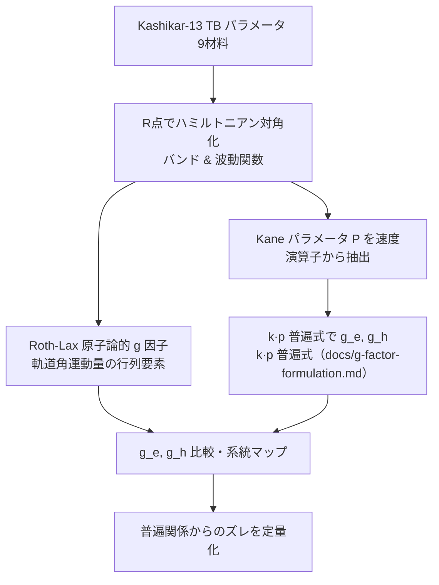

# PI 向け解説: Theme A — ハライドペロブスカイト 9 材料の Landé g 因子マップ

**対象読者:** プロジェクト PI（材料物理・凝縮系が専門ではない方）
**方針:** 専門用語は初出でその場で定義。数式は最小限、物理的な「絵」を優先。主要数値は Production `results/production/theme_A_g_factor/2026-05-23_31374dc/MANIFEST.json` の `key_numbers`、9 材料の全表は同 bundle の `outputs/raw/g_factor_9material.csv` から引用。

---

## 0. 30 秒サマリ

- **何を計算したか**: 9 種類のハライドペロブスカイト（CsBX₃; B=Ge/Sn/Pb, X=Cl/Br/I）について、電子と正孔（穴）の
  **g 因子**——磁場の中でスピンがどれだけエネルギーを変えるかを表す数——を、タイトバインディング（TB）法で計算した。
- **何が新しいか**: 「正孔の g 因子は材料によらずバンドギャップだけで決まる」という最近の**普遍関係**（鉛系で発見）が、
  **鉛フリーの Sn/Ge 系では破れる**（普遍曲線から上にずれる）ことを 9 材料で系統的に示した。
- **デバイス応用**: g 因子はスピントロニクス・量子情報（スピン量子ビット）・磁気光学（ファラデー回転）デバイスの
  設計指標。鉛フリー材料でこれを予測できると、毒性 Pb を避けた spin デバイス設計に役立つ。

---

## 1. 物理的背景（なぜこの量が重要か）

### 1.1 g 因子とは何か（中学〜学部初年度レベルで）
電子は「自転（スピン）」している小さな磁石のようなもの。磁場 B をかけると、磁石の向きによってエネルギーが
わずかに変わる（**ゼーマン効果**）。その変化量は ΔE = g·μ_B·B で、比例係数 **g が「g 因子」**。
- 真空中の自由電子では g ≈ 2.0023（ほぼ 2）。
- **結晶の中**では、電子は周りの原子と相互作用するため g が 2 から大きくずれる（−10 〜 +6 などになる）。
  この「ずれ」こそが、その材料の電子状態の指紋。
- 半導体には電子だけでなく**正孔（ホール）**——電子が抜けた「穴」が粒子のように振る舞うもの——もあり、
  正孔にも g 因子がある（g_h）。電子の g_e と正孔の g_h は別物。

**アナロジー**: g 因子は「スピンという小さな羅針盤が、結晶という環境の中で磁場にどれだけ敏感に反応するかの感度」。

### 1.2 なぜハライドペロブスカイトで調べるか
ハライドペロブスカイト（CsPbI₃ など）は太陽電池で大注目の材料だが、**重い原子（Pb など）由来の強い
スピン軌道相互作用（SOC, 後述）**を持つため、スピン物性が豊か。最近、磁気光学実験（Kirstein et al., arXiv:2112.15384）で
g 因子が精密測定され、**「g 因子はバンドギャップ Eg だけでほぼ決まる」普遍関係**が鉛系で見つかった。
- 量子ビット（スピンで情報を保持）や、円偏光で電流を作るデバイスに g 因子は直結。
- GaAs など既存半導体では g 因子の理解が進んでいるが、ペロブスカイト、特に**鉛フリー（Sn/Ge）**は未解明。

### 1.3 なぜ TB（タイトバインディング）か
- **第一原理計算（DFT）**は精密だが重く、g 因子のような微妙な量を多材料で出すのは大変。
- **TB**: 原子軌道を基底に、ホッピング（電子の飛び移りやすさ）を少数のパラメータで表す軽量手法。論文で
  パラメータ化済みのモデル（Kashikar 2021）を使えば、9 材料を一気に・再現可能に計算できる。
- **限界も正直に**: TB は経験パラメータ依存。さらに位置演算子に近似（Blount 1962、§5）があり g の絶対値は
  過小評価しうる。そこで本研究は **TB を 2 つの方法（原子論的 Roth-Lax と k·p 普遍式）で併用**して相互検証した。

---

## 2. 何を計算したか（手順）

### 2.1 入力
- 9 材料 CsBX₃ の Kashikar 2021 の **13 軌道 active basis** TB パラメータ（出典付き JSON; 同論文は 4 軌道 minimal も提案、本研究は 13 軌道を採用）。
- 各材料の R 点（直接ギャップの場所）のバンド構造と波動関数。

### 2.2 計算手順

### 2.3 計算規模
9 材料 × 2 手法（Roth-Lax + k·p）。決定論的（乱数なし）。R 点 1 点の対角化が主で軽量（秒オーダー）。

---

## 3. 結果（数値 + 物理的解釈）

### 3.1 主結果の表（9 材料、`MANIFEST.json key_numbers` より）

| 材料 | Eg (eV) | SOC Δ (eV) | 電子 g_e | 正孔 g_h | g_h の普遍曲線からのズレ |
|---|---|---|---|---|---|
| CsGeCl₃ | 3.40 | 0.21 | 0.71 | 1.86 | +0.59 |
| CsGeBr₃ | 2.32 | 0.21 | 1.82 | 1.71 | +1.08 |
| **CsGeI₃** | 1.60 | 0.21 | 3.39 | 1.41 | **+1.86** |
| CsSnCl₃ | 2.85 | 0.48 | 1.17 | 1.59 | +0.57 |
| CsSnBr₃ | 1.77 | 0.48 | 2.91 | 1.03 | +1.12 |
| **CsSnI₃** | 1.30 | 0.42 | 4.56 | 0.48 | **+1.81** |
| CsPbCl₃ | 3.04 | 1.53 | 0.99 | 1.11 | −0.01 |
| CsPbBr₃ | 2.36 | 1.44 | 1.76 | 0.70 | +0.04 |
| CsPbI₃ | 1.73 | 1.26 | 3.01 | 0.03 | +0.20 |

（図: `results/g_factors/figures/fig1_g_factor_universality.png`（g_e/g_h 普遍性）、
`fig2_gh_deviation_vs_delta.png`（ズレ vs SOC Δ））

> **不確かさの注:** Sn/Ge の SOC Δ は Kashikar 3λ 由来で ±20% の不確かさを持つ。これに対する g_h の幅は bundle CSV の `g_h_lo/g_h_hi` に記録され、最大で CsSnI₃ の g_h=0.48 [0.26, 0.72]（±約 0.23）、最小で CsGeCl₃ の ±約 0.03。**主結果（鉛フリー Sn/Ge の上方乖離 +1.8 級）はこの幅に対して頑健**。

### 3.2 結果の物理的読み解き
- **電子 g_e は「見かけの普遍性」**: 9 材料すべてが、バンドギャップ Eg だけで決まる 1 本の曲線（k·p 普遍曲線）に
  ほぼ載る（図1a）。Eg が小さいほど g_e が大きい（CsSnI₃ で 4.56、CsPbCl₃ で 0.99）。
  → ハロゲンを Cl→Br→I と変えると Eg が縮み、g_e が増える、という明快なトレンド。
- **正孔 g_h は鉛フリーで普遍関係が破れる（★主結果）**: 鉛系（CsPbX₃）の g_h は普遍曲線にほぼ載る（ズレ ≈ 0）。
  ところが **Sn 系・Ge 系は普遍曲線から上に +1〜+1.9 もずれる**（CsGeI₃ +1.86, CsSnI₃ +1.81）。
- **なぜ破れるか（直観）**: 正孔 g_h の普遍式は SOC 分裂 Δ が大きい（=Pb のように重い原子）ことを暗に仮定している。
  **Sn/Ge は軽くて Δ が小さい**（Pb の Δ≈1.3–1.5 eV に対し Sn≈0.4, Ge≈0.2 eV）。Δ→0 の極限で g_h は普遍式の予言
  ではなく自由正孔値 +2 に近づくため、Δ が小さい Sn/Ge ほど上方乖離が大きくなる。図2 で「ズレ vs Δ」がきれいに
  Δ 小 → ズレ大 を示す。

### 3.3 既知文献・実験値との比較
- 鉛系 CsPbX₃ の g_e/g_h は Kirstein et al.（arXiv:2112.15384, in-repo）の k·p 普遍関係とよく一致（普遍曲線に載る）。
- 鉛フリー Sn/Ge は実験データが乏しく、本研究は **TB に基づく予測**を提供（実験検証待ち）。
- なお Roth-Lax 原子論的 g 因子は実験より絶対値が小さく出る（例: 普遍関係に比べ過小）。これは TB の構造的限界
  （§5, Blount 1962）であり、**符号・トレンドは信頼できるが絶対値は割り引いて読む**。そのため主結論は k·p 普遍式
  ベースで述べている。

---

## 4. 何が新しいか（論文化視点）
- 既存（Kirstein et al. arXiv:2112.15384, Nestoklon 2023 ら）は **鉛系**で g 因子の普遍関係を確立。
- 本研究は **鉛フリー（Sn/Ge）9 材料**へ拡張し、**正孔 g_h の普遍関係が SOC の弱い系で系統的に破れる**ことを
  TB で初めて系統マップ化。鉛フリー spin デバイス設計の指針になりうる（詳細は `cowork/novelty_assessment.md`）。

## 5. 限界と今後の課題
- **TB の構造的限界（Blount 1962）**: TB の位置演算子は原子内成分を欠くため、g の絶対値（特に Roth-Lax）は
  系統的に過小。→ 相対トレンド・符号・普遍性の破れは信頼可、絶対値は要注意。
- **改善の道筋**: DFT→Wannier 化した位置演算子で絶対値を補正、励起子効果の取り込み、実験（磁気光学）との直接比較。

## 6. 用語集
- **g 因子**: 磁場中でスピンのエネルギーがどれだけシフトするかの係数。自由電子で 2.0023。
- **正孔（ホール）**: 電子が抜けた「空席」。あたかも正電荷の粒子のように動く。
- **バンドギャップ Eg**: 電子が詰まった帯（価電子帯）と空の帯（伝導帯）の energy の隙間。光吸収の閾値。
- **スピン軌道相互作用（SOC, Δ）**: 電子の軌道運動とスピンが結合する効果。重い原子（Pb）ほど強い。Δ はその分裂幅。
- **Roth-Lax**: 結晶中 g 因子を軌道角運動量から計算する原子論的手法（Roth-Lax-Zwerdling 1959）。
- **k·p 法**: バンド端近傍を少数バンドの相互作用で展開する近似。Kane パラメータ P がカップリングの強さ。
- **Slater-Koster / タイトバインディング**: 原子軌道を基底に、2 中心積分（ホッピング）で結晶のバンドを表す手法。
- **Wannier 関数**: バンドを実空間の局在軌道で表したもの。位置演算子の精密化に使う。

## 7. 出典
- R. Kashikar et al. 2021, **arXiv:2101.08562**（TB モデル本体）— 9 材料の SK パラメータ。
- E. Kirstein et al., **arXiv:2112.15384**（in-repo `references/pdfs/arxiv_2112.15384.pdf`「The Landé factors of electrons
  and holes in lead halide perovskites: universal dependence on the band gap」）。本研究で用いた k·p 普遍式の定数
  （P=6.8 eV·Å, Δ=1.5 eV）と式の詳細は `docs/g-factor-formulation.md`（プロジェクト内で検証済み）を参照。
- M. O. Nestoklon et al. 2023（arXiv:2305.10586, in-repo; CsPbX₃ ナノ結晶の ETB+k·p による g 因子の量子閉じ込め拡張）。
- R. Roth 1960, *Phys. Rev.* 118, 1534（in-repo `references/pdfs/classic_Roth1960_PR118_1534.pdf`; g 因子 k·p 原典）。
  関連: Roth–Lax–Zwerdling 1959（PR 114, 90 — 巻号は要原典確認、in-repo 外）。
- E. I. Blount 1962（TB 位置演算子の限界; *Solid State Phys.* **13**, 305 (1962) "Formalisms of band theory", DOI 10.1016/S0081-1947(08)60459-2; OA 書誌確認済・in-repo PDF なし（旧 *Phys. Rev.* 126, 1636 表記は誤り））。
- Production bundle: `results/production/theme_A_g_factor/2026-05-23_31374dc/`、技術報告書: `cowork/reports/theme_A_g_factor.md`。
