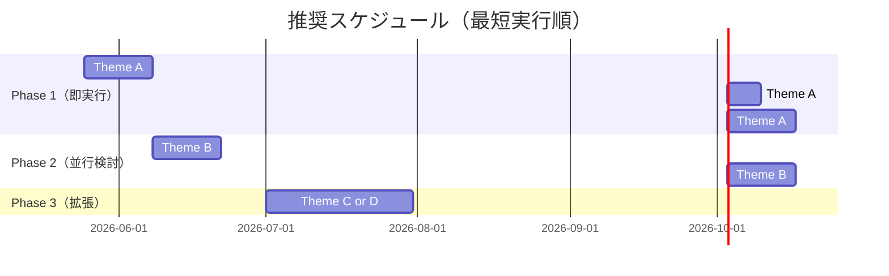

# 研究ネタ案（2026-05-23）

既存リポジトリの強み（163テスト通過のNestoklon sp³d⁵s\* / Kashikar 13軌道エンジン、9材料 × 2モデルのパラメータ済み）を活かし、**ノートPC + Python で完結**するスケールで、**2025-2026 の最新動向にホットなテーマ**を提案します。

最新動向の調査結果（2025-2026）と既存49本のギャップを照合し、新規性・実現性・タイムリーさで絞り込みました。

## ホットトレンド要約（2025-2026）

| トレンド | 代表的な最新文献 | 既存49本のカバー状況 |
|---|---|---|
| **Chiral perovskite spintronics / CPEL** | Liu 2025 Adv. Sci.（multifunctional chiral）, Gaurav 2026 Adv. Mater.（spin-LED） | 2309.14002 のみ。デバイス応用との接続不足 |
| **Bond-angle engineering → Rashba** | Phillips 2026 Adv. Funct. Mater.（giant spin splitting）, arxiv:2512.06773（polaron spin funneling） | 0本。完全な空白 |
| **ML-TB Hamiltonian (HamGNN/DeepH/HAMSTER)** | HAMSTER 2026 Nat. Commun.（halide perovskite 50k atoms）, UEIPNet 2025 | 2505.18027 (VQE-TB) のみ。古典ML 0本 |
| **Layer-dependent g-factor (2D RP)** | 2605.15807（Kopteva 2026） | 2605.15807/2305.10586/2112.15384 三部作。Pb系のみ |
| **Anharmonic / dynamic disorder + TB** | Benitez 2025（band-gap by phonon coupling）, 2105.06525 | 1本（Abramovitch）。発展余地大 |

---

## 提案テーマ（推奨順）

### Theme A — CsBX₃ 9材料の Landé g因子 系統マップ（既存エンジンで即実行可能）

**何をするか:** 既存の Nestoklon sp³d⁵s\* / Kashikar 13軌道エンジンに **g因子計算モジュール**を追加し、CsBX₃ 全9材料（B = Ge, Sn, Pb; X = Cl, Br, I）の電子・正孔 g因子を一気にマップする。

**なぜ今やる価値があるか:**
- Kirstein 2021 (2112.15384) と Nestoklon 2023 (2305.10586) は **Pb 系のみ** の「g因子はバンドギャップで普遍的に決まる」関係を提唱
- Ge 系・Sn 系で同じ関係が成り立つか、誰もまだ系統的に示していない（2026-05時点）
- 鉛フリーペロブスカイト LED の設計指針として直接的に意味がある
- 既存リポの 9 材料 R点ギャップ（CsGeI₃ 0.64 / CsSnI₃ 0.175 / CsPbI₃ 0.63 eV など）と直接組み合わせるだけ

**実装規模:** Python 200-300 行 + テスト。既存の 4 軌道 / 13 軌道 Hamiltonian から二次摂動展開で `g_e`, `g_h` を解析的に出せる（Roth–Lax 公式）。

**期待される新規性:**
- Pb-only の普遍関係を Sn・Ge に拡張、もしくは破綻条件を示す
- 鉛フリー光学スピン素子の材料候補ランキング表（B,X 9マス）

**論文化の見通し:** Letter サイズ（5-6ページ）で Phys. Rev. B Rapid Comm. もしくは npj Comput. Mater. を狙える。鉛フリー × g因子は確実にニッチかつ未開拓。

---

### Theme B — Pb-X-Pb ボンド角 → Rashba 分裂の TB マップ（CPEL設計指針）

**何をするか:** 既存の Kashikar 13軌道に **オクタヘドラル傾斜の自由度**を加え（X-anion を変位させる Slater-Koster 角度因子の修正）、Pb-I-Pb / Pb-Br-Pb ボンド角を 180° → 150° に振りながら **Rashba 係数 α** を抽出する。

**なぜ今やる価値があるか:**
- Phillips 2026 Adv. Funct. Mater.「Giant spin splitting」、arxiv:2512.06773「polaron spin funneling」など 2025-2026 のホット論文は **「ボンド角を変えれば α が変わる」** を実験的・第一原理的に主張しているが、**TB スケールで一気にスキャンした例はない**
- TB なら 1ジョブ数秒、ボンド角 10ステップ × 9材料 × 2軌道基底 = 数百ジョブが半日で回る
- 「α を最大化する最適角度」を CsPbBr₃ など実材料の既知歪み量で評価し、Spin-LED 設計指針として提示できる

**実装規模:** Slater-Koster のオフセット項に角度パラメータ θ を入れる修正 + α 抽出ルーチン（k 軸沿いのバンドフィット）。既存テストへの破壊変更は不要。新規 300-400 行。

**期待される新規性:**
- TB スケールの Rashba マップ（B,X,θ）の系統解析
- 「実験で報告されている歪み量で α が ~X meV·Å」という定量予測

**論文化の見通し:** Phys. Rev. B regular article。CPEL 実験グループ（Manchester, Brown, ITMO 等）の理論パートナー位置取りが狙える。

---

### Theme C — Kashikar 9材料パラメータの ML 内挿で「混合 B サイト」(Cs(Sn,Pb)X₃) を予測

**何をするか:** 既存リポにある **Kashikar 13軌道パラメータ × 9材料 × 出典付き JSON** を学習データとして、シンプルな Gaussian Process / ランダムフォレストで「B カチオンの原子半径・電気陰性度を入力 → Slater-Koster パラメータを出力」する回帰モデルを作る。混合 B サイトの Cs(Sn,Pb)X₃ や Cs(Ge,Sn)X₃ の電子構造を Vegard 則を超える精度で予測。

**なぜ今やる価値があるか:**
- HamGNN / HAMSTER などの 2025 ML-TB 系は **巨大データセット + GNN** で重い。「9材料しかない小データで TB パラメータを内挿する」のは別の問題設定で、ノートPC でやる価値がある
- 鉛フリー化を目指す混合 B 組成は実験で盛んだが、理論側がほぼ追いついていない
- 既存リポの JSON パラメータをそのまま訓練データに使える → コードリユース率最大

**実装規模:** scikit-learn ベース、500 行程度。ハイパーパラメータも少ない。

**期待される新規性:**
- 「9 個の TB パラメータセットを使った小データ ML」という方法論サブストーリー
- 実用面：実験で組成スキャンしている人がノートPC上で電子構造を試算できるツール提供

**論文化の見通し:** J. Chem. Theory Comput. または J. Phys. Chem. Lett.。Methodology paper として手堅い。

---

### Theme D — Apergi 2023 の chiral CD を Kashikar 13軌道で実装し、Sn/Ge 系へ拡張

**何をするか:** Apergi 2309.14002 が DFT-parameterized TB で計算した chiral halide perovskite の CD スペクトルを、既存リポの **論文値再現済み 13軌道モデル**で再実装する。Apergi らは Pb 系のみ計算しているので、Sn 系・Ge 系に拡張する。

**なぜ今やる価値があるか:**
- 2026 Adv. Mater. の Gaurav「chiral spin-LED」が示すように、chiral perovskite LED は実用段階に入りつつある
- だが理論側の「材料スクリーニング」が圧倒的に足りない。CD を予測する系統研究は数えるほど
- 既存リポは Pb・Sn・Ge を同じ Hamiltonian で扱える → Apergi の Pb-only を一気に拡張するのに最適

**実装規模:** Apergi 論文の (4)-(7) 式（速度演算子 + 磁気双極子）を実装。400-500 行。

**期待される新規性:**
- 鉛フリー chiral perovskite の CD 予測表
- Apergi 方法論の独立な再実装による交差検証（科学コミュニティへの貢献）

**論文化の見通し:** Phys. Rev. Materials または J. Phys. Chem. C。

---

### Theme E（任意・大物）— 2D Ruddlesden-Popper 拡張（n=1,2,3,4）と層数依存 g 因子

**何をするか:** 既存の立方 CsPbI₃ Nestoklon sp³d⁵s\* を **n 層の RP 構造**に拡張。Z軸方向に有限スラブ + 真空。層数 n を 1→4 でスキャンし、層数依存 g因子と励起子結合エネルギーを予測。

**なぜ今やる価値があるか:**
- 2605.15807 (Kopteva 2026) は実験で n=1-4 の g 因子を測定し、理論との照合を求めている
- 既存リポはまだ 3D のみ。**2D 化は自然な次ステップ**で実験との直接比較が可能

**実装規模:** スラブモデル + 表面終端パラメータの導入。やや重く 800-1000 行。並列化が必要だが laptop で n=2 までは現実的、n=3,4 は工夫が必要。

**論文化の見通し:** PRB regular。やや重いがインパクト大。

---

## 推奨ロードマップ（laptop時間で 2-3 ヶ月）

**最初の 3 週間で Theme A の主結果**まで持っていけば、論文1本目の骨格が立ちます。

---

## 重要：選択の根拠

最終的に **Theme A → B → C の順** で進める案を強く推します。理由：

1. **A は既存エンジンに 200-300 行足すだけ**で「鉛フリー × g因子マップ」という独立した研究成果になる。リスク最小・リターン明確
2. **B は A の結果（g因子マップ）と直接連携**できる。同じ Hamiltonian でボンド角を振るだけ。再利用率が高い
3. **C は A+B のデータが揃った後にやると効率最大**。9材料 × 角度 × 軌道基底のデータが学習材料になる

A 単独でも論文1本、A+B で 2本、A+B+C で 3本（または高インパクト 1本）が現実的な見通しです。
