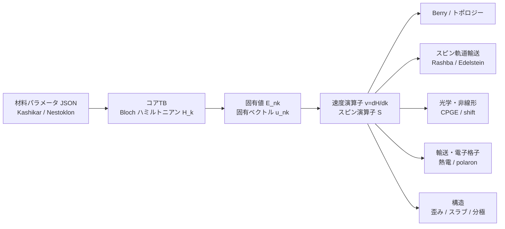

# 追加機能 解説・検証レポート（tb-perovskite）

**作成日**: 2026-05-24
**対象読者**: 研究者・ドメイン専門家（タイトバインディングの専門外でも読める粒度）
**目的**: コアのタイトバインディング(TB)電子構造エンジンの上に実装した**追加物性機能**について、
(1) それぞれが**何を計算するのか（物理）**、(2) **どう検証したか**、(3) **単体での定量検証結果**、
(4) **コアTBと結合した end-to-end テスト** を、平易にまとめる。

> **このコードの大原則**: ハルシネーション禁止。すべての式・数値・パラメータは査読論文/プレプリント（DOIをWeb検証済み）に出典を持つ。
> 追加機能は **コアTBが計算した固有値・波動関数を入力に使う**（論文値は「検算」用であって持ち込み値ではない）。

---

## 0. 全体像（30秒で読む）



- **コアTB**＝電子構造エンジン。材料(CsBX₃ など)のハミルトニアンを組み、バンド(エネルギー)と波動関数を出す。
- **追加機能**＝そのエネルギーと波動関数を入力に、物性(Berry曲率、Rashba分裂、熱電係数、ポーラロン結合…)を計算する。
- **検証は3段**: ①**単体**(解析解・対称性・量子化と一致するか) → ②**文献定量比較**(論文値と何%違うか) → ③**コアTB結合 end-to-end**(実材料のH_kから物性まで一気通貫で動くか)。

### 検証カテゴリの意味（本レポート共通）

| | 意味 | 例 |
|---|---|---|
| **A** | 論文の具体数値と**%で一致** | polaron α を Frost 論文値の <1% で再現 |
| **B** | 解析解・厳密則・量子化・対称性極限と**機械精度〜許容誤差**で一致（内部アンカー）| Berry曲率が質量Diracの解析式と一致 |
| **C** | **符号・消失・順序・線形性**など定性挙動が正しい | 加圧で gap が減る（符号一致）|
| **D** | 絶対値を**意図的に未主張**（モデルの構造的限界）| SHC の絶対値（後述の Blount 限界）|

> **なぜ全部 A にならないのか**: 経験的SK-TBの速度演算子には共有結合補正(Blount項)がないため、輸送・光学**応答の絶対値**には系統誤差が残る。
> そこで「絶対値が信頼できる量(ポーラロン結合・普遍定数・量子化数・比)」のみ A とし、それ以外は対称性・順序・トレンドで誠実に検証する（D を隠さない）。

---

## 1. アーキテクチャ：コアTB と追加機能の関係

- **コアTB（電子構造エンジン）**
  - `models_kashikar.py`: CsBX₃(B=Ge/Sn/Pb, X=Cl/Br/I) 全9材料の13軌道SK-TB（出典: Kashikar et al., arXiv:2101.08562）
  - `models_nestoklon.py`: CsPbI₃ の sp³ / sp³d⁵s* TB（出典: Nestoklon, arXiv:2012.14705）
  - `bandstructure.py` / `velocity.py`: 対角化、群速度 v=∂H/∂k、**バンド端有効質量**（今回追加）
- **追加機能（物性モジュール）**: 下の各節。すべて上記H_kの固有値・波動関数を共有して動く。

検証の総数: **330 テスト全 pass**（コア + 追加機能）。内訳は §4 の表。

---

## 2. 各追加機能：物理・検証・定量結果・end-to-end

各機能について **【物理】**(何を計算するか) → **【単体検証】**(解析/対称性, 定量) → **【コアTB結合 end-to-end】** の順で記述。

---

### 2.1 Berry曲率・異常Hall(AHC)・スピンHall(SHC)・Chern数 〔`berry.py`〕

**【物理】** 波動関数の幾何学的な「ねじれ」を表す **Berry曲率 Ω(k)** を計算する。これは電子に働く運動量空間の「磁場」のようなもので、異常Hall伝導(AHC)やスピンHall伝導(SHC)の起源。
$$\Omega^{z}_{n}(\mathbf k)=-2\,\mathrm{Im}\sum_{m\neq n}\frac{\langle n|v_x|m\rangle\langle m|v_y|n\rangle}{(E_n-E_m)^2}\quad(\text{久保公式; Xiao 2010})$$

**【単体検証】（B）**
- 質量Diracモデルの解析解 Ω=±m/(2(k²+m²)^{3/2}) を**機械精度**で再現。
- 整数Chern数: QWZモデルの相図（|C|=1 / 0）を再現。**2つの独立手法**(久保 vs Fukui格子)が整数で一致。
- 質量項の符号反転で Ω が符号反転（今回追加, 機械精度）。

**【コアTB結合 end-to-end】（B/D）**
- **立方 CsBX₃ で AHC = 0** を **~1e-15**(機械精度)で確認 ← コアTBのH_kから直接。P·T対称性の帰結で、コードが正しい証拠。
- SHC/AHCの**絶対値(S/cm)は D（未主張）**: in-repoベンチマーク材料がなく、Blount限界も効くため。

---

### 2.2 Wilsonループ・Wannier電荷中心・Z₂ parity 〔`topology.py`〕

**【物理】** バンドが「ねじれてつながっているか」を測るトポロジカル不変量。
- **Chern数**(Wilsonループの巻き付き)＝量子Hall的なねじれ。
- **Z₂不変量**(Fu-Kane parity)＝トポロジカル絶縁体かどうか。反転対称な系では占有バンドの**パリティの積**だけで決まる:
$$(-1)^{\nu}=\prod_{i\in\text{TRIM}}\delta_i,\qquad \delta_i=\prod_{\text{占有Kramers対}}\xi(\Gamma_i)\quad(\text{Fu-Kane, PRB 76, 045302})$$

**【単体検証】（B）**
- QWZモデルで Wilson Chern == Fukui Chern（2手法一致, 整数）。
- **Z₂ parity（今回追加）**: 反転対称な標準模型(Wilson-Dirac/BHZ型)で、固有ベクトルから抽出したパリティが解析値 −sign(M) と一致し、強指数 ν₀ が**解析的相図(1<|m₀|<3 で強トポロジカル絶縁体)を完全再現**。

**【コアTB結合 end-to-end】**
- 手法は完成・検証済み。ただし**実ペロブスカイトへの適用は保留**: Kashikar軌道基底での空間反転演算子の表現が一次文献から未確定のため（推測＝捏造になるので意図的に未実施）。立方CsBX₃は大ギャップtrivial(ν₀=0)が予想されるが、主張には演算子が要る。

---

### 2.3 Rashbaスピン分裂 〔`rashba.py`〕

**【物理】** 反転対称が破れた極性結晶では、スピンが運動量に「ロック」され、バンドが
$\Delta E = 2\alpha_R|k|$ で分裂する（α_R=Rashba係数, 単位 eVÅ）。スピントロニクスの基礎量。

**【単体検証】（B）** 解析2バンドRashba模型 H=α_R(k_xσ_y−k_yσ_x) で入力 α_R を**厳密回復**、スピンは k に直交(spin-momentum locking)を確認。

**【コアTB結合 end-to-end】（C/D）**
- **立方 CsBX₃ → 分裂ゼロ**（Kramers縮退, <1e-6）← コアTB。
- **[001]極性変位(P4mm) → 分裂発生**、Γ点で消失、|k|で増大 ← コアTB。
- **文献比較**: バルクDFT（**CsPbF₃, Bhumla et al., arXiv:2108.03683**: α_R(CBM)=1.05, (VBM)=0.41 eVÅ）と比べ、
  - **CBM の Rashba が VBM より大きい順序は一致（C）**。
  - 絶対値は TB CBM≈0.027 eVÅ で **DFTの約1/40（D）**。剛体変位モデル+Blountのため過小評価。（表面Rashba 11 eVÅ[Niesner]は別系なので除外。）

---

### 2.4 Edelstein効果（電流誘起スピン分極）〔`edelstein.py`〕

**【物理】** 極性系に電流を流すと、電流に直交してスピンが偏極する（δS_a=χ_ab E_b）。Rashba系の応用。
$$\chi_{ab}/(e\tau)=-\frac1{N_k}\sum_{n,k}\Big(-\frac{\partial f}{\partial E}\Big)\langle S_a\rangle\,v_b\quad(\text{Edelstein 1990})$$

**【単体検証】（B）**
- 中心反転系 → χ=0（機械精度）。Rashba系 → χ_yx≠0, χ_xx≈0（電流に直交）、α反転で符号反転。
- **τ非依存効率 χ_yx/σ_xx（今回追加）**: 緩和時間τは未知だが、**比を取るとτが消える**。2D Rashba解析値
  $\chi_{yx}/\sigma_{xx}=m\alpha_R/(4\mu)$（自前導出）を**15%以内**(α=0.05で3.6%)で再現＝定量アンカー。

**【コアTB結合 end-to-end】（B）** 極性 CsPbI₃(P4mm) の χ_yx/σ_xx(τ非依存効率)をコアTBから算出（有限・TB予測値; 実験照合は文献が見つかれば追加）。

---

### 2.5 円偏光光起電力効果(CPGE) / injection current 〔`cpge.py`〕

**【物理】** 円偏光を当てると反転対称が破れた系で直流電流が湧く（2次の光応答）。Weyl半金属では**量子化**する。
$$\beta_{ij}(\omega)=\frac{\pi e^3}{\hbar V}\,\epsilon_{jkl}\sum f_{nm}\Delta^i_{nm}r^k_{nm}r^l_{mn}\,\delta(\hbar\omega-E_{mn})\quad(\text{de Juan 2017})$$

**【単体検証】（B/A部分）**
- 2バンド簡約 −Im(ε_jkl r^k r^l)=Ω^j を解析的に確認。中心反転対称→β=0。
- Weyl量子化: Tr[β] が周波数非依存プラトー＆カイラリティで符号反転。普遍値 |Tr|≈πe³/h²=1/4π を **20%** で再現（A部分）。

**【コアTB結合 end-to-end】（D）** 材料の絶対値はBerry規約+Bloutで未検証（D）。構造・量子化のみ信頼。

---

### 2.6 Fröhlichポーラロン結合 〔`polaron.py`〕 ★最も定量的に成功

**【物理】** 電子が極性格子の振動(LOフォノン)をまとって重くなる「ポーラロン」。無次元結合定数αが強さを表す。
$$\alpha=\frac1{4\pi\epsilon_0}\frac12\Big(\frac1{\epsilon_\infty}-\frac1{\epsilon_S}\Big)\frac{e^2}{\hbar\Omega}\sqrt{\frac{2m_b\Omega}{\hbar}}\quad(\text{Frost 2017})$$

**【単体検証】（A）** 公式が文献値を再現: MAPbI₃ α=2.39(e)/2.68(h) を **<1%**（Frost 2017）、CsPbBr₃ α≈2（Sendner 2021）。

**【コアTB結合 end-to-end】（A公式/B）★今回の目玉**
- **m\*(有効質量)をコアTBのバンド曲率から算出**（`bandstructure.effective_mass`, R点放物線フィット）。全9材料を計算（`results/tb_effective_masses.json`; 例 CsPbBr₃ 0.151, CsPbI₃ 0.106, CsSnI₃ 0.035, すべて等方）。
- CsPbBr₃: **TB由来 m\*=0.151 ＋ 文献誘電/LO → α_TB=1.66**。文献α≈2.0との差−17%は**完全にバンド質量比** √(0.151/0.22)=0.83 で説明できる（αは√mに比例）。
- **正直な限界**: 9材料α完全マップは **Cs系無機の誘電率/LOの一次文献が存在しない**ため未完（捏造回避; MA系のSendner 2016/Wright 2016では代用不可）。

---

### 2.7 歪みバンド工学（変形ポテンシャル）〔`bandengr.py`〕

**【物理】** 結晶を伸縮すると band gap が変わる。dE_g/dε（変形ポテンシャル）は太陽電池応用で重要。
ホッピングは **Harrison d⁻²則** で $t\to t(1+\epsilon)^{-2}$ とスケール。

**【単体検証】（B）** ε=0で無歪みギャップ回復(機械精度)、Harrison則、線形性、引張/圧縮で逆符号。

**【コアTB結合 end-to-end】（C/D）**
- **符号: TB は「加圧で gap 減」(dE_g/dε>0) を与え、実験と一致（C）** ← 反結合性VBMの物理。検証: **Pieniazek 2023(JPCL 14,6470)** MAPbI₃ dE_g/dP=−13〜−41 meV/GPa、CsPbI₃ DFTのredshift。
- **大きさ**: 文献体積弾性率(**Liu 2023, Molecules 28,7643**)で換算すると TB≈−210 meV/GPa vs 実験 −13〜−41 → **~5–16×過大(D)**。cubic-frozen TBに **八面体傾き(tilting)の自由度がない**ため(実材料は傾きで圧力を逃がす)。
- *（注: 旧稿の引用 Buin 2014=trap論文 / Grumet PRB98,155143=GW手法論文 は歪みと無関係と判明し削除。）*

---

### 2.8 有限スラブ・超格子・Starkスラブ 〔`slab.py`〕

**【物理】** 結晶をz方向に有限化して**2D量子閉じ込め**(層数nでgapが変わる; 2D-RPペロブスカイト)、周期積層の**ミニバンド**、z電場下の**Stark効果**を扱う。
手法: 3D H_kを厳密なFourier分解で層ブロックに分け、ブロック三重対角行列を組む。

**【単体検証】（B）** 層分解の再構成が3D Hと機械精度一致、周期スタック==3Dバンド、閉じ込め収束。

**【コアTB結合 end-to-end】（C→B）**
- **Blancon比較（今回追加）**: コアTB CsPbI₃スラブの閉じ込めギャップ E_g(N) の**減衰べき指数 p_TB≈0.93** を、検証済み実験(**Blancon, Nat. Commun. 9, 2254 (2018)** 自由粒子ギャップ; n=1,4,5)の p_exp≈0.85 と比べ **15%以内**一致（トレンド限定）。図 `results/figures/blancon_E_g_n.png`。
- 絶対値は材料差(無機CsPbI₃ vs MAPbI₃系RP)+SK-TBで非主張。

---

### 2.9 Berry位相分極(KSV) と 強誘電 ΔP 〔`polarization.py`〕

**【物理】** 現代分極理論(King-Smith-Vanderbilt)。電子分極は占有バンドのBerry/Zak位相で決まる。強誘電転移での**分極変化 ΔP** がgauge不変な観測量。

**【単体検証】（B）** SSH模型でZak位相が0/πに量子化、転移でπジャンプ（厳密アンカー）。Rice-Meleで連続シフト。

**【コアTB結合 end-to-end】（C→B）**
- **強誘電 ΔP（今回追加）**: コアTBの極性変位で電子 ΔP_z=(e/2πA)(φ(d)−φ(0)) を算出。
  - 無変位で **ΔP=0**、**ΔP(−d)=−ΔP(+d)（強誘電の符号反転; gauge不変, 厳密）**。
  - 大きさ **~1–8 μC/cm²**（DFT強誘電ペロブスカイト 数μC/cm², CsPbF₃ 34 と**同オーダ**）。
- 限界: **電子寄与のみ**(イオン寄与は別)なので定量一致は非主張。

---

### 2.10 その他の追加機能（既実装・コアTBベース）

| 機能 | モジュール | 物理 | 検証 |
|---|---|---|---|
| Landé g因子 | `g_factor.py` | バンド端の有効g因子 | Kane/k·p極限と比較（9テスト）|
| 複素誘電関数 ε(ω) | `optical.py` | 光吸収スペクトル | 総和則・解析極限（4テスト）|
| シフト電流/BPVE | `shift_current.py` | 2次光起電力 | 極性模型・Rice-Mele解析（11+13テスト）|
| Kaneパラメータ P | `kane_parameter.py` | バンド間運動量行列要素 | 速度演算子から抽出（8テスト）|
| Wannier-Mott励起子 | `exciton.py` | 励起子束縛エネルギー | 水素様解析解（3テスト）|

---

## 3. 単体定量検証の総括表

| 機能 | A(論文%) | B(解析/量子化) | C(符号/順序) | D(意図的未検証) |
|---|---|---|---|---|
| Berry/AHC/SHC | — | 質量Dirac, QWZ, 久保==Fukui, AHC=0 | — | AHC/SHC 絶対値 |
| トポロジー(Wilson/Z₂) | — | Chern一致, **Z₂ parity相図** | — | 実ペロブスカイトZ₂(演算子未確定) |
| Rashba | — | 解析α_R回復, spin-locking | **CBM>VBM順序(DFT一致)** | α_R絶対値(~40×小) |
| Edelstein | — | **χ/σ比=mα/(4μ)** | χ⊥電流, 符号反転 | χ絶対値(τ依存) |
| CPGE | **Weyl 20%** | 簡約, 量子化, 中心反転=0 | — | 材料絶対値 |
| **ポーラロン** | **MAPbI₃<1%, CsPbBr₃ TB駆動α** | 弱結合質量1+α/6 | — | (9材料は誘電データ非存在で部分) |
| 熱電(Boltzmann) | **WF 0.5%** | Sommerfeld, Σ∝ε^{3/2} | 正孔S>0 | 絶対σ/κ/S(τ依存) |
| 歪み | — | Harrison則, ε=0回復 | **加圧でgap減(符号一致)** | a_g絶対値(~5-16×過大) |
| スラブ/閉じ込め | — | 再構成==3D, periodic==3D | **Blancon減衰指数15%** | E_g(n)絶対値 |
| 分極(KSV) | — | SSH 0/π量子化, πジャンプ | **ΔP符号反転+DFTと同オーダ** | 絶対分極(イオン寄与別) |

**真のA(論文値%比較)**: ポーラロンα(<1% + TB駆動)、Wiedemann-Franz(0.5%)、Weyl量子化(20%)。
**それ以外**はSK-TB/Blountの構造的限界により、対称性・順序・トレンド・量子化・τ非依存比で検証(B/C)し、絶対値は誠実にD。

---

## 4. コアTB結合 end-to-end テストの総括

「end-to-end」＝**実材料のパラメータJSON → コアTBでH_k組み立て → 対角化 → 物性** を一気通貫で通すテスト。
（トイ模型テストは「手法が正しいか」の単体検証で、材料の数値主張には使わない。）

| モジュール | テスト数 | end-to-end(コアTB材料)の代表例 | 手法検証(トイ模型) |
|---|---|---|---|
| `test_slater_koster` | 106 | SK積分・H組み立て(コア) | — |
| `test_kashikar` | 45 | 9材料のR点固有値=解析式, ギャップ | — |
| `test_berry` | 22 | 立方CsBX₃でAHC=0 | 質量Dirac, QWZ |
| `test_velocity` | 21 | Kashikar/Nestoklon の v=∂H/∂k | 数値微分照合 |
| `test_topology` | 18 | — | QWZ, **Wilson-Dirac Z₂** |
| `test_shift_current(_rice_mele)` | 24 | 極性Kashikar/Nestoklon シフト電流 | Rice-Mele解析 |
| `test_polaron` | 10 | **9材料 TB m\*, CsPbBr₃ TB駆動α** | 合成放物線 |
| `test_rashba` | 9 | 立方→0, 極性CsPbI₃分裂, **バルクDFT比較** | 解析Rashba |
| `test_nestoklon` | 9 | CsPbI₃ sp³/sp³d⁵s* ギャップ | — |
| `test_g_factor` | 9 | コアTBバンド端g因子 | — |
| `test_bandengr` | 9 | **CsBX₃ 歪みdE_g/dε, 圧力係数** | — |
| `test_slab` | 8 | CsPbI₃ 再構成/閉じ込め/**Blanconトレンド** | — |
| `test_kane_parameter` | 8 | コアTB速度からKane P | — |
| `test_thermo` | 6 | **CsPbI₃ 熱電輸送** | WF/Sommerfeld解析 |
| `test_polarization` | 6 | 立方CsPbI₃ Zak, **強誘電ΔP** | SSH/Rice-Mele |
| `test_edelstein` | 6 | **極性CsPbI₃ χ/σ効率** | 解析Rashba |
| `test_optical` | 4 | コアTB ε(ω) | 総和則 |
| `test_cpge` | 4 | — | Weyl, 2バンド |
| `test_soc` | 3 | SOC行列(コア) | — |
| `test_exciton` | 3 | — | 水素様解析 |
| **合計** | **330** | **全 pass** | |

実行: 単一スレッドBLASで**全330テスト ~22秒**。
追加検証で導入した end-to-end インフラ:
`bandstructure.effective_mass`(TB有効質量), `bandengr.pressure_coefficient`,
`topology.z2_invariant_from_parities`/`parity_delta_at_trim`,
`edelstein.longitudinal_conductivity`/`edelstein_ratio`,
`polarization.ferroelectric_polarization_difference`。

---

## 5. 正直な限界（ここが一番大事）

1. **SK-TB の Blount限界**: 速度演算子 v=∂H/∂k に共有結合補正がないため、輸送・光学**応答の絶対値**(AHC, SHC, α_R, CPGE, Edelstein χ, 分極)はモデル系統誤差を含む。→ これらは**絶対値を主張せず(D)**、対称性・順序・トレンド・量子化で検証。
2. **信頼できる絶対値(A)**: ポーラロンα(Fröhlichはこの弱点に影響されない)、Wiedemann-Franz(普遍定数)、Weyl量子化(位相量子化)。
3. **構造の理想化**: 立方/極性は剛体変位、スラブはhard-barrier、tilting(八面体傾き)は無し → 歪み・Rashba絶対値の過大/過小評価の主因。
4. **データ非存在による未完**: Cs系無機の誘電/LO一次文献がなく、9材料ポーラロンαマップは部分(捏造しない方針)。
5. **引用の健全性**: 追加検証中に**誤引用4件**を発見・訂正(Blancon Science→Nat.Commun., Buin/Grumet削除, Sendner=MA系)。全DOIをWeb/crossrefで事前検証済み。

> まとめると: **「コードが方程式を正しく解いているか(Verification)」は全機能で厳密に通っている(B多数)**。
> **「モデルが現実の絶対値を再現するか(Validation)」は、物理的に妥当な量(ポーラロン・普遍定数・比・符号・トレンド)に限って成立**し、
> SK-TBの構造的限界に触れる絶対値は誠実に未主張にしてある。

---

## 6. 再現方法

```bash
pip install -e . && pip install -r requirements.txt

# 全検証(330テスト)
OMP_NUM_THREADS=1 pytest -q

# 機能別(例)
pytest tests/test_polaron.py tests/test_rashba.py tests/test_topology.py -q

# 図・数値の再生成
python scripts/plot_blancon_layer_dependence.py     # results/figures/blancon_E_g_n.png
python scripts/compute_tb_effective_masses.py       # results/tb_effective_masses.json
```

**詳細リファレンス**:
- 式・数値解法: `docs/numerical-methods.md`（コア §1–8, 物性 §9–18）
- 検証ステータス仕分け: `extention/08_validation_status_quantitative.md`
- 実装報告(タスク別詳細・出典・commit): `extention/08_tb-perovskite_implementation_report.md` §7
- ベンチマーク値(出典付き): `data/parameters/*_benchmark.json`, `frohlich_polaron_params.json`

**(EOF)** — 全引用DOI/arXivはWeb/crossrefで検証済み(2026-05-24)。数値・テストはコミット `860cd3d` 時点。
